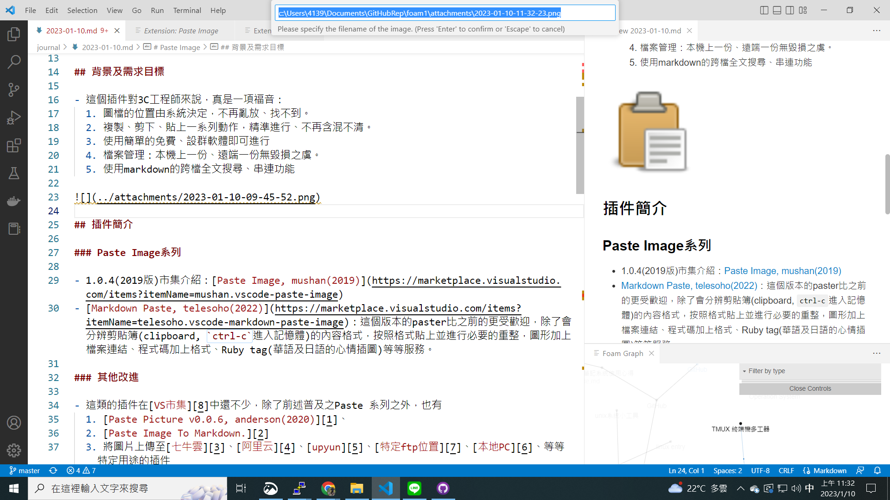

# Tuesday, January 10, 2023

- #elasticsearch
- [[tmux]]
- path before attachments：`https://raw.githubusercontent.com/sinotec2/foam1/master`
[tmux]: ../docs/OperationSystem/tmux "TMUX 終端機多工器"

# Paste Image

> 3C工程師的福音
> 從此貼圖有word的便利、卻能有markdown的簡約感、未來感

## 背景及需求目標

- 這個插件對3C工程師來說，真是一項福音：
  1. 圖檔的位置由系統決定，不再亂放、找不到。
  2. 複製、剪下、貼上一系列動作，精準進行、不再含混不清。
  3. 使用簡單的免費、設群軟體即可進行
  4. 檔案管理：本機上一份、遠端一份無毀損之虞。
  5. 使用markdown的跨檔全文搜尋、串連功能

## 插件簡介

### Paste Image系列

- 1.0.4(2019版)市集介紹：[Paste Image, mushan(2019)](https://marketplace.visualstudio.com/items?itemName=mushan.vscode-paste-image)
- [Markdown Paste, telesoho(2022)](https://marketplace.visualstudio.com/items?itemName=telesoho.vscode-markdown-paste-image)：這個版本的paster比之前的更受歡迎，除了會分辨剪貼簿(clipboard, `ctrl-c`進入記憶體)的內容格式，按照格式貼上並進行必要的重整，圖形加上檔案連結、程式碼加上格式、Ruby tag(華語及日語的心情插圖)等等服務。

### 其他改進

- 這類的插件在[VS市集][8]中還不少，除了前述普及之Paste 系列之外，也有
  1. [Paste Picture v0.0.6, anderson(2020)][1]、
  2. [Paste Image To Markdown.][2]
  3. 將圖片上傳至[七牛雲][3]、[阿里云][4]、[upyun][5]、[特定ftp位置][7]、[本地PC][6]、等等特定用途的插件

## Paste Image安裝設定

- 只須點選`install`即可安裝
- 不需進一步設定

## Paste Image使用

### 選取與貼上

- 使用任何剪取工具皆可(剪取工具、win10的剪取與繪圖、excel圖面上按下`ctrl-C`、mac的螢幕截圖工具等等)、
- 回到VSCode文件處，按下`ctrl-alt-v`，會出現對話框顯示內設的儲存位置與檔名，如不修改直接下`enter`鍵即會在文件處出現markdonw之連結`![] ../(PATH_to_png)/YYYY-MM-DD-hh-mm-ss.png`。

### 文字及圖檔的發布

- 直接交付檔案：注意需同時複製文件與前述圖檔，最好以壓縮程式，同時點選文件及圖檔後「傳送到->壓縮的資料夾」，解開時就可以仍然保持目錄的正確性。
- 上傳至雲端
  - 如以github為例，因為github對圖檔有另外的顯示策略，url的路徑不能以相對路徑型態，需加上絕對路徑
  - 如以前述剪貼版示意圖而言，必須連接到另一個url位置raw.githubusercontent.com及master(pull ID)
    - 相對路徑``
    - 絕對路徑`https://raw.githubusercontent.com/sinotec2/foam1/master/attachments/2023-01-10-09-26-55.png)`
- 上傳到[wiki.js][9]

[//begin]: # "Autogenerated link references for markdown compatibility"
[tmux]: ../docs/OperationSystem/tmux "TMUX 終端機多工器"
[//end]: # "Autogenerated link references"
[1]: https://marketplace.visualstudio.com/items?itemName=anderson.vscode-extension-paste-image "Paste Picture：Paste image directly from clipboard to markdown/asciidoc(or other file)! Support Mac/Windows/Linux! And support config destination folder."
[2]: <https://marketplace.visualstudio.com/items?itemName=Liu-Yongle.paste-image-to-markdown> "Paste Image To Markdown. v1.0.0 by Liu-Yongle(2019)"
[3]: https://marketplace.visualstudio.com/items?itemName=favers.paste-image-to-qiniu "vscode-paste-image-to-qiniu(2017) 一个可以支持截图粘贴上传图片到七牛、让你写用vscode写markdown有更好的体验。"
[4]: https://marketplace.visualstudio.com/items?itemName=jasonroger.paste-image-to-aliyun "paste image to aliyun, v0.0.2 by jason roger(2017) 一个可以支持截图粘贴上传图片到阿里云、让你写用vscode写markdown有更好的体验。"
[5]: https://marketplace.visualstudio.com/items?itemName=firshme.paste-image-to-upyun "paste image to upyun v0.0.7,by firshme, 截图上传又拍与云插件"
[6]: https://marketplace.visualstudio.com/items?itemName=sakamoto66.vscode-paste-image "Paste Image from local pc, v1.1.9 by sakamoto66, paste image from local pc clipboard directly"
[7]:https://marketplace.visualstudio.com/items?itemName=ziok2010.vscode-paste-image-ftp "Paste Image Ftp v0.2.2, by ziok2010(2017)paste image from clipboard directly and upload ftp server"
[8]: https://marketplace.visualstudio.com/ "  Visual Studio   |   Marketplace"
[9]: http://125.229.149.182:8000/zh-tw/note_system/剪貼簿/paste_image "Paste Image 3C工程師的福音 > 從此貼圖有word的便利、卻能有markdown的簡約感、未來感"

> by https://matters.news/@mjysci, 2021 年 10 月 5 日
- Evernote恰恰是网页摘抄做得太好，让使用者过于依赖反而停止了思考，所以我的用法有所不同：摘抄用[diigo][diigo_wiki]，看完立即思考，组织语言写感想并记入[Joplin][Joplin]（一个基于markdown的类Evernote开源笔记软件）。时间紧则简单写几个关键词待空闲时扩充。
- 利用Joplin强大的搜索功能可以立即找到相关文章和自己提炼的心得，若对网页链接的文章生疏了则点开链接，这时浏览器的diigo插件会给之前的摘抄高亮显示便于立即唤起记忆。
- 官網
  - [Diigo](https://www.diigo.com/)
  - [joplinapp.org](https://joplinapp.org/)

[diigo_wiki]: https://zh.wikipedia.org/zh-tw/Diigo "Diigo是一個社會性書籤網站，Diigo是'Digest of Internet Information, Groups and Other stuff'的縮寫。除了可以將網頁添加作書籤、添加標籤，使用者還可以將網頁內容突出顯示、添加說明，還可以將這些書籤作為公開或私藏，還可以將書籤與朋友分享。 維基百科"
[Joplin]: https://en.wikipedia.org/wiki/Joplin_(software) "譯自英文-Joplin是一個免費的開源桌面和移動筆記應用程序，以JavaScript編寫，用於類Unix和Microsoft Windows操作系統，以及iOS，Android和Linux / Windows終端。桌面應用程序使用Electron製作，而移動應用程序使用React Native。 维基百科（英文)"

# Roam Research

items|Obsidian|Roam|LogSeq|description
-|:-:|:-:|:-:|-
UI|3|1|2+|
VUC|1|||visualizing usable connections between notes
backlinks||1|1|easiest, most intuitive, and most visual way to surface backlinks
Sidebar|3|2+|1|less customizable, but more clearly functional
Block Ref||1|1|best for making powerful connections between atomic note elements across notes
MD|1|||best implementation of standard Markdown formatting
Search/Query|||1|most powerful search tools and best implementation of embedded queries
Daily Notes||1|1|most functional, clearly understood implementation of Daily Notes
Tasks|||1|best implementation of task management features
Expandability|1|||easiest and most powerful way to expand capabilities of the core application
Theming|1|||easiest way to customize the look and feel of the application without needing to know CSS
Data Portability|1|||most flexible for moving data in and out
Publishing and Sharing|1|||easiest way to securely share contents from your PKM
Data Security|1||2+|most secure storage and syncing of your notes library
Mobile Experience|1++|||best experience for working with your notes from an iPhone
Pricing|1|3--||

[MIKE22]: https://thesweetsetup.com/obsidian-vs-roam/ "Obsidian vs. Roam vs. LogSeq: Which PKM App is Right For You?, FEBRUARY 28, 2022, BY MIKE SCHMITZ"

# Foam

[[2023-01-13]]

