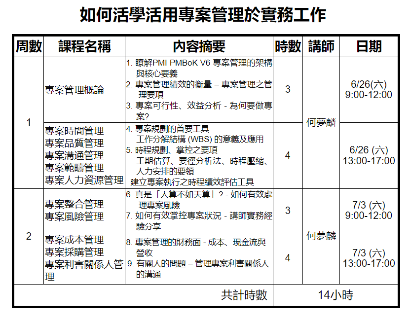
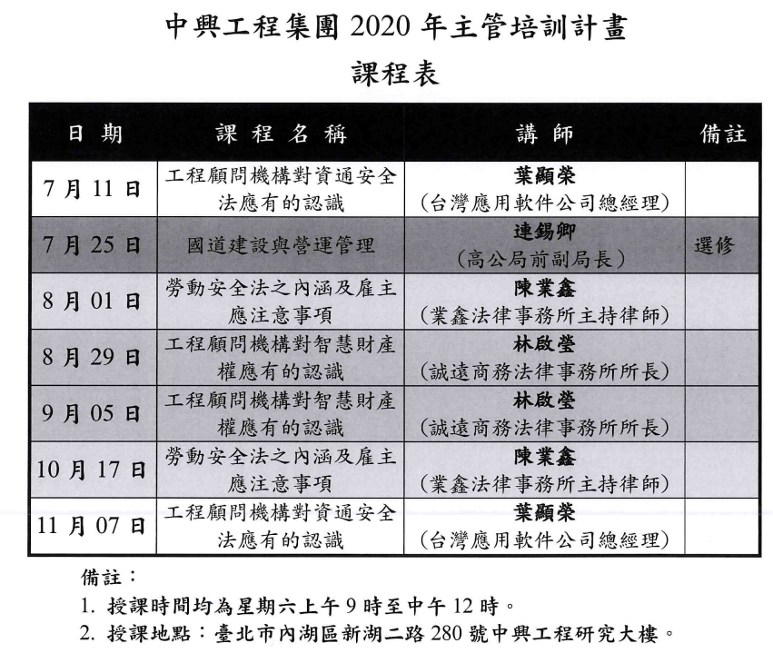

# Monday, January 16, 2023


## 如何活學活用專案管理於實務工作
from 	edm <edm@sinotech.org.tw> 
- 標題:	2021中興社專案管理系列課程2 : 如何活學活用專案管理於實務工作
- 日期:	Thu, 29 Apr 2021 10:48:18
各位中興工程集團同仁大家好,
 
中興社將於6月底開辦一班 "如何活學活用專案管理於實務工作" 的課程，
不論您是否已上過我們辦理的PMP國際專案管理，
亦或是已取得PMP國際專案管理師的資格，
這個14小時的課程，我們將邀請20多年教學經驗豐富的老師，
引導您認識什麼是專案管理，
透過實務的案例說明，
讓各位更深刻理解如何活學活用專案管理於實務工作。
歡迎有興趣的同仁洽詢報名
招生簡章及課表如附件
報名網站 https://reurl.cc/XeVDR7
 
有任何問題歡迎隨時來電詢問
 
謝謝
 
   
陳志倫
財團法人中興工程顧問社
企劃推廣處
02-8791-9198 #456

如何活學活用專案管理於實務工作

一、  課程對象:

1.新手主管

2.企業內各部門主管或儲備幹部

3.現已為管理者欲強化工作

4.希望能有效達成工作計畫目標及提高工作效能之中高階主管、基層主管、處理專案之工程師及儲備主管等

5.對本課程有興趣或各專案行政人員者

6.擔任專案團隊成員並具有發展潛力者


二、課程目的/效益:


本課程內容以專案管理知識體指南PMBOK® V6

Guide (A Guide to the Project Management Body of Knowledge) 第 6 版

之內容及講師20多年豐富的管理實務經驗所規劃設計

 

1.使學員瞭解專案管理的正確觀念與核心價值

2.有效的運用專案管理方法提昇個人與部門的績效

3.掌握專案管理規劃的核心關鍵能力

4.學習時程管理及人力資源分配之規劃與管理能力

5.瞭解專案管理的財務面知識 - 成本、現金流與營收三者關係

6.學習系統思考提升管理決策力


三、課程大綱:

 

1.瞭解PMI PMBOK V6 專案管理的架構與核心要義

2.專案管理績效的衡量 – 專案管理之管理要項

3.專案可行性、效益分析 - 為何要做專案?

4.專案規劃的首要工具 – 工作分解結構 (WBS) 的意義及應用

5.時程規劃、掌控之要項

  – 工期估算、要徑分析法、時程壓縮、人力安排的要領

  – 建立專案執行之時程績效評估工具

6.真是「人算不如天算」? - 如何有效處理專案風險

7.如何有效掌控專案狀況 - 講師實務經驗分享

8.專案管理的財務面 - 成本、現金流與營收 

9.有關人的問題 – 管理專案利害關係人的溝通

 

四、實作演練/活動/

 

1.案例討論

 

五、費用 : 14小時 / NT$ 8,000元 (包括:教材及餐點)
中興工程集團員工優惠價：每人NT$ 6,000元。

 

報名方式

網路報名

敬請前往本社網站報名 https://reurl.cc/XeVDR7 並將個人基本資料及ATM轉帳/匯款收據帳號後五碼於線上填寫報名，始完成報名手續。

 

課程時間與地點

日期：110年06月26、07月03日(星期六)

時間：每周六 AM 09:00 - PM 17:00

地點：中興大業大廈10樓大教室 (臺北市南京東路五段171號)

           捷運南京三民站1號出口

 

備註事項

本研習營已報請行政院工程會核備，參加之土木各類技師可取得訓練積分及亞太工程師積分登記。
PMI台灣分會為本課程協辦單位，課程結訓後核發PMI® 國際專案管理學會認可之PDU。

 

課程相關問題、企業包班、量身定制專案管理相關課程，

歡迎電洽課程經辦人陳志倫，電話(02)8791-9198轉456。

2021如何活學活用.jpg



## 2020 主管培訓

	標題:	中興社-「中興工程集團2020年主管培訓計畫」
 	日期:	Mon, 22 Jun 2020 16:35:09

長官　您好：
由中興社企劃推廣處舉辦「中興工程集團2020年主管培訓計畫」，
敬請長官自行報名參訓；詳細課程資訊請參附件。
 
```
l   培訓名稱：中興工程集團2020年主管培訓計畫
　　培訓時間：星期六09:00-12:00（請參附件）
　　培訓地點：中興工程研究大樓２樓國際會議廳或訓練教室(臺北市內湖區新湖二路280號)
l   報名網址：https://reurl.cc/ZOdygW
　　報名截止日：109年07月01日前
l   主辦單位：中興社企劃推廣處
　　聯 絡 人：林彥享 研究員
　　聯絡電話：02-8791-9198 分機457
```


## it系統使用現況及-未來趨勢之應用

https://www.facebook.com/193709161453248/posts/20180901-主管培訓主題it系統使用現況及未來趨勢之應用主講者周總工程師-頌安地點中興社研究大樓-訓練教室/274089570081873/
20180901-主管培訓主題it系統使用現況及未來趨勢之應用
主講者周總工程師-頌安
地點中興社研究大樓-訓練教室/